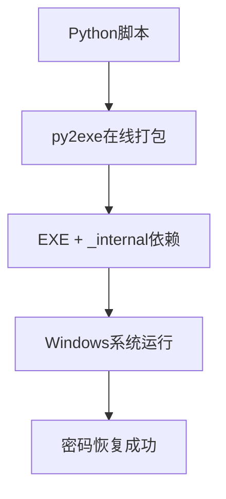

🔓 Seewo密码恢复工具 (EXE便携版)

项目出处: 基于 CatMe0w/bruteforce_passwordv3 进行打包优化


📋 目录

· 项目简介
· 打包方式
· 文件结构
· 功能特性
· 系统要求
· 安装使用
· 工作原理
· 注意事项
· 故障排除
· 许可证

🎯 项目简介

这个工具专门用于从希沃设备的配置文件中恢复锁屏密码和管理员密码。基于 CatMe0w/bruteforce_passwordv3 项目，使用在线py2exe工具打包成可执行文件，无需Python环境即可运行。

通过分析系统配置文件和注册表信息，使用多进程暴力破解技术找回6位数字密码。

📦 打包方式

打包工具和方法

· 打包工具: py2exe.com 在线打包服务
· 打包方式: 直接上传Python脚本，自动生成EXE文件和依赖
· 修改情况: 除打包外，未对原始代码进行任何修改
· 完整性: 保持原始项目的所有功能和算法逻辑

打包输出结构

```
项目目录/
├── Pasward_V_Passwardv3.exe     # 主程序可执行文件
└── _internal/                   # 必要的依赖文件目录
    ├── python3x.dll             # Python运行时库
    ├── 其他依赖DLL文件...        # 其他必要的动态链接库
    └── ...                     # 其他运行时文件
```

在线打包优势

· 🚀 无需本地环境 - 不需要安装Python或py2exe
· ⚡ 快速便捷 - 上传即打包，简化流程
· 🔒 代码保持 - 确保与原始项目完全一致
· 📁 完整依赖 - 包含所有必要的运行时文件

📁 文件结构

打包后完整文件结构

```
SeewoPasswordRecovery/
├── Pasward_V_Passwardv3.exe      # 主程序可执行文件
├── _internal/                    # 运行时依赖目录（必需）
│   ├── python3x.dll             # Python解释器核心
│   ├── *.pyd                    # Python扩展模块
│   ├── *.zip                    # Python标准库压缩包
│   └── 其他必要的DLL和资源文件   # 确保程序正常运行
└── README.md                    # 项目说明文档
```

重要说明

· 必需依赖: _internal 文件夹必须与主程序在同一目录下
· 不可删除: 删除 _internal 文件夹将导致程序无法运行
· 完整分发: 分发时需要同时包含EXE文件和_internal文件夹

✨ 功能特性

🔍 核心功能

· 双密码恢复 - 同时恢复锁屏密码和管理员密码
· 多进程破解 - 利用多核CPU加速密码破解过程
· 自动信息收集 - 从系统和配置文件中自动提取必要信息
· 错误处理 - 完善的异常处理和日志记录

🎯 目标密码

· 锁屏密码 - 从SeewoLockConfig.ini恢复
· 管理员密码 - 从SeewoCore.ini恢复
· 6位数字 - 支持000000-999999的暴力破解

💻 系统要求

必需条件

· 操作系统: Windows 7/10/11
· 运行环境: 无需Python，直接运行EXE
· 目标设备: 安装有SeewoCore软件的希沃设备
· 内存: 至少2GB可用内存
· 磁盘空间: 需要约50MB空间存放程序文件

依赖项

· 所有依赖已包含在_internal文件夹中
· 无需额外安装任何库或框架
· 包含完整的Python解释器和运行时库

🚀 安装使用

完整安装步骤

1. 下载完整包 - 获取包含EXE和_internal文件夹的完整程序包
2. 保持文件结构 - 确保_internal文件夹与EXE文件在同一目录
3. 直接运行 - 双击Pasward_V_Passwardv3.exe启动程序
4. 自动检测 - 程序自动检查系统环境和配置文件
5. 密码恢复 - 等待程序完成密码破解过程
6. 查看结果 - 获取恢复的锁屏和管理员密码

运行流程

```
开始执行 → 检查系统环境 → 读取配置文件 → 
获取设备信息 → 暴力破解密码 → 输出结果
```

重要提醒

· ✅ 保持完整: EXE文件和_internal文件夹必须在一起
· ✅ 不要移动: 不要单独移动EXE文件到其他位置
· ✅ 完整分发: 分发时包含整个程序目录

🔧 工作原理

技术架构



密码恢复算法

1. 配置文件解析 - 读取SeewoCore.ini和SeewoLockConfig.ini
2. 系统信息收集 - 获取设备ID和机器标识符
3. 盐值构造 - 基于特定格式组合标识符
4. 哈希比对 - SHA256(密码+盐值)暴力破解
5. 结果输出 - 显示找到的密码

核心模块

· 配置读取 - 解析INI配置文件格式
· 注册表访问 - 获取Windows系统信息
· 多进程处理 - 并行计算加速破解
· 哈希计算 - SHA256算法实现

⚠️ 注意事项

法律与道德

· ⚖️ 仅限合法用途 - 请在拥有设备所有权或获得授权的情况下使用
· 🔒 责任声明 - 使用者需自行承担使用该工具的法律责任
· 📜 教育目的 - 建议用于教育学习和授权测试

技术限制

· 🔢 密码格式 - 仅支持6位纯数字密码
· 🖥️ 平台限制 - 仅适用于Windows系统的希沃设备
· ⏱️ 时间消耗 - 暴力破解可能需要几分钟到几十分钟
· 🛡️ 杀毒软件 - 部分杀毒软件可能误报，请添加信任

文件依赖要求

· ✅ 完整文件结构 - 必须保持EXE和_internal文件夹的完整结构
· ✅ 不可分离 - 不能单独运行EXE文件
· ✅ 路径正确 - 确保程序从正确的位置启动
· ✅ 权限足够 - 需要读取系统文件和注册表的权限

🔍 故障排除

常见问题

问题现象 可能原因 解决方案
"无法启动程序" 缺少_internal文件夹 确保_internal文件夹与EXE在同一目录
"缺少DLL文件" 依赖文件不完整 重新下载完整程序包
"SeewoCore.ini not found" 配置文件路径错误 检查Seewo软件安装路径
"Registry key not found" 注册表项缺失 确认系统为希沃定制版本
程序闪退 系统兼容性问题 以管理员身份运行
无法找到密码 密码非6位数字 使用其他恢复方法

文件结构问题

如果遇到文件缺失错误：

1. 确认_internal文件夹存在且完整
2. 检查EXE文件和_internal文件夹的相对路径
3. 不要重命名或移动_internal文件夹
4. 从原始打包位置重新获取完整文件

打包相关问题

由于使用在线py2exe打包，如遇运行问题：

1. 确认Windows版本兼容性
2. 检查系统架构(32/64位)
3. 以管理员权限运行
4. 暂时禁用安全软件
5. 确保文件结构完整

📄 许可证

MIT License

```
Copyright (c) 2025 CatMe0w

Permission is hereby granted, free of charge, to any person obtaining a copy
of this software and associated documentation files (the "Software"), to deal
in the Software without restriction, including without limitation the rights
to use, copy, modify, merge, publish, distribute, sublicense, and/or sell
copies of the Software, and to permit persons to whom the Software is
furnished to do so, subject to the following conditions:

The above copyright notice and this permission notice shall be included in all
copies or substantial portions of the Software.

THE SOFTWARE IS PROVIDED "AS IS", WITHOUT WARRANTY OF ANY KIND, EXPRESS OR
IMPLIED, INCLUDING BUT NOT LIMITED TO THE WARRANTIES OF MERCHANTABILITY,
FITNESS FOR A PARTICULAR PURPOSE AND NONINFRINGEMENT. IN NO EVENT SHALL THE
AUTHORS OR COPYRIGHT HOLDERS BE LIABLE FOR ANY CLAIM, DAMAGES OR OTHER
LIABILITY, WHETHER IN AN ACTION OF CONTRACT, TORT OR OTHERWISE, ARISING FROM,
OUT OF OR IN CONNECTION WITH THE SOFTWARE OR THE USE OR OTHER DEALINGS IN THE
SOFTWARE.
```

本项目基于 CatMe0w/bruteforce_passwordv3 项目，遵循相同的MIT许可证。

🙏 致谢

· 感谢 CatMe0w 的原始项目
· 感谢 py2exe.com 提供的在线打包服务
· 感谢所有贡献者和测试者

🔄 更新记录

· 2025-11-22 - 使用py2exe.com在线打包，创建EXE版本
· 保持同步 - 功能与原始项目完全一致，仅作打包处理

---

版本: v3.0 (EXE便携版)
打包日期: 2025年11月22日
打包工具: py2exe.com
原项目: bruteforce_passwordv3
修改说明: 仅作打包处理，功能代码零修改
文件要求: 必须包含_internal依赖文件夹

---

⚠️ 重要提醒:

1. 请负责任地使用此工具，遵守相关法律法规和道德准则
2. 本工具仅限用于授权的设备恢复和教育工作
3. 必须保持EXE文件和_internal文件夹的完整结构
